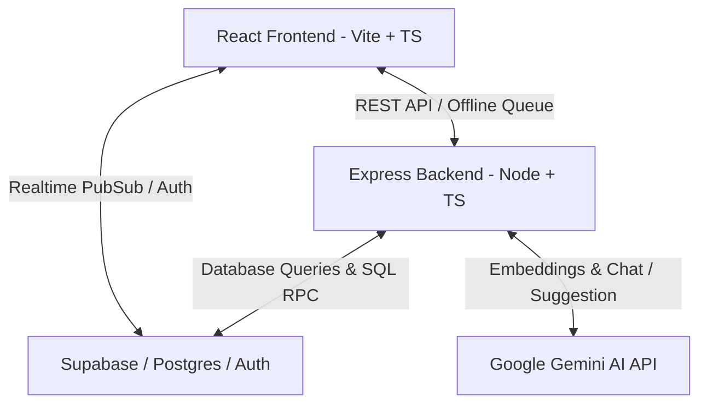
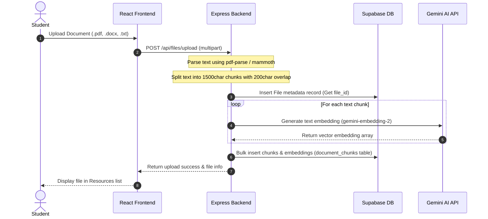
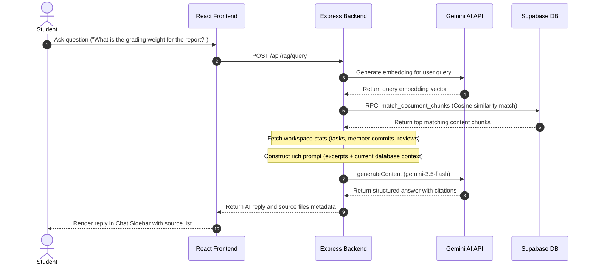
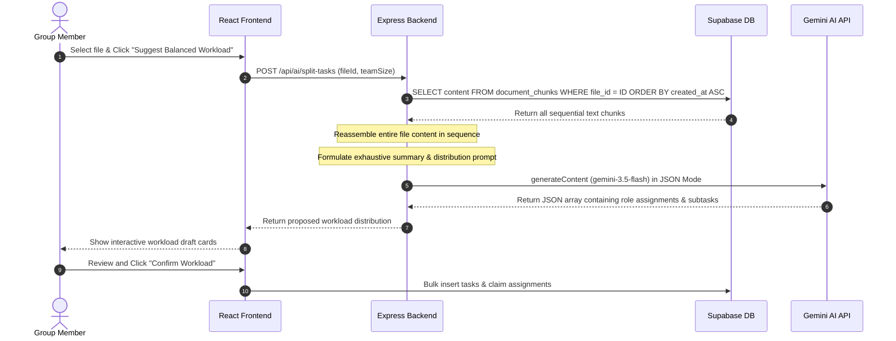
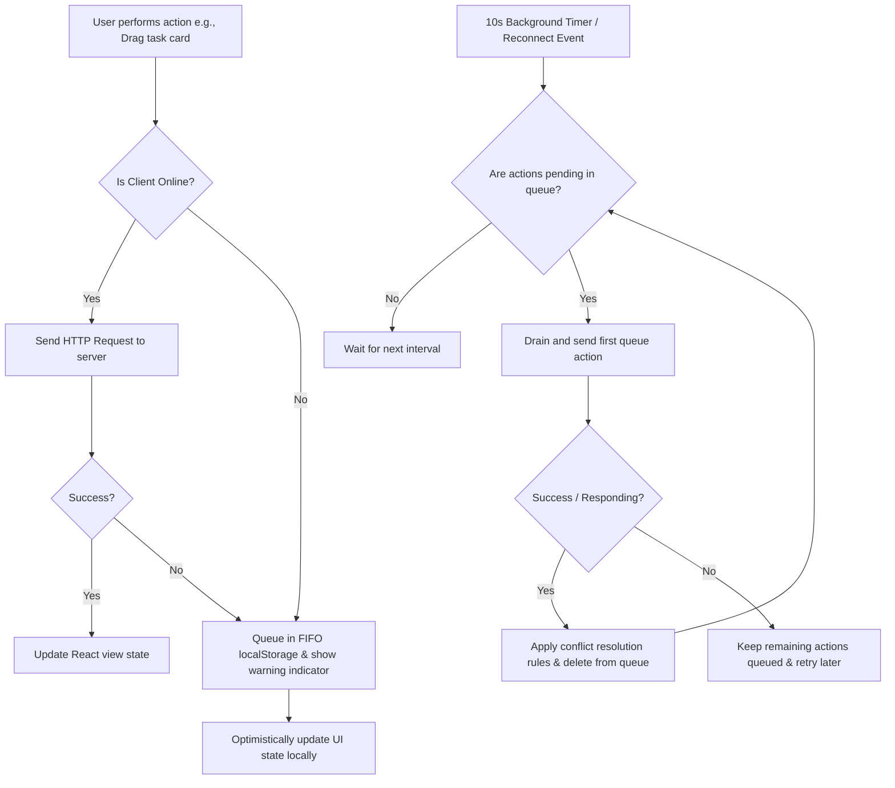

# 0-Mess Project Documentation 🎓
*A Centralized, Real-Time Collaboration & Accountability Platform for University Group Assignments*

---

## 1. Planning & Approach

Group projects in universities frequently suffer from the **"free-rider" effect (social loafing)**, coordination friction, and fragmented communication tools. The planning of **0-Mess** focused on solving these human and technical hurdles:
1. **Low Friction Onboarding**: Instant registration and direct team member enrollment via email so teams can begin working immediately.
2. **Transparent Accountability**: A dynamic, multi-metric performance score algorithm (tasks completed + git activity + peer review metric) to ensure contribution is tracked fairly.
3. **Resilience in Unstable Environments**: Since students work on the go (in libraries, cafes, or public transit), the application implements an robust offline-first synchronization engine.
4. **Intelligent Assistance (AI)**: Splitting requirements into fair tasks, and semantic query answering.

---

## 2. Technical Architecture & Tech Stack

### Tech Stack
* **Frontend**: React 19 (TypeScript), Vite, Tailwind CSS, Framer Motion (animations), Lucide React (icons).
* **Backend**: Node.js, Express, TypeScript, Mammoth (DOCX parser), PDF-Parse (PDF parser).
* **AI Engine**: Google Gemini API (`@google/genai`).
* **Database & Realtime**: Supabase (PostgreSQL with `pgvector` for similarity embeddings, JWT Auth, and real-time subscription channels).

---

## 3. Key Technical Decisions & Reasoning

* **Supabase Realtime vs. WebSockets Polling**:
  - We utilized Supabase Realtime client libraries to subscribe to Postgres changes (`postgres_changes`) directly from the React components. This eliminates polling overhead, decreases CPU usage, and reflects teammates' task card drags, commits, and meetings instantly.
* **Offline-First FIFO Queueing & Optimistic UI**:
  - All write operations route through a mutation manager. If the connection fails, mutations are queued in `localStorage` in FIFO order while the UI updates optimistically. A background sync loop checks connection health every 10 seconds and flushes the queue sequentially when online.
* **Cosine Similarity RAG vs. Entire-Document AI Analysis**:
  - **RAG (AI Chatbot)**: Utilizes vector embeddings stored in Supabase `pgvector`. A user prompt is converted into an embedding, and the database runs a cosine similarity match to retrieve the top 8 chunks. This is ideal for quickly answering specific user queries about syllabus files or slide documents.
  - **Entire-Document AI Workload Builder**: For task creation, a similarity query is inadequate because it might skip key guidelines or deliverables. Instead, the backend pulls *all* document chunks matching a file ID sorted by creation time, reassembles the complete document text, and feeds it to Gemini to extract every single coursework deliverable without omission.

---

## 4. Key Feature Flowcharts

### A. Document Indexing Flow
When a student uploads a course rubric or syllabus file:

### B. RAG Chatbot Semantic Query
When a student asks the chatbot a question in the workspace sidebar:

### C. Entire-Document AI Workload Suggestion Engine
When the team uses the AI Workload Suggestion Engine to generate the task list:

### D. Offline-First Mutation & Sync Engine
When a teammate makes changes while offline:

